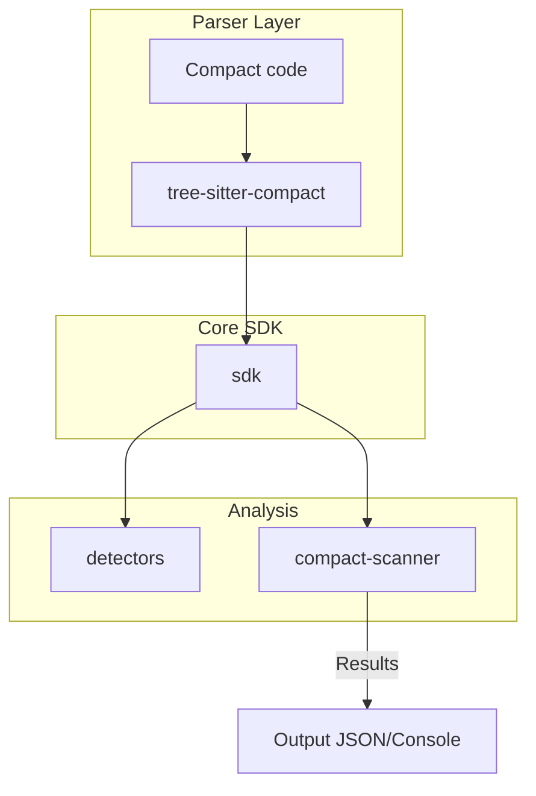

[](https://github.com/OpenZeppelin/compact-security-detectors-sdk/actions/workflows/build.yml)
[](https://github.com/OpenZeppelin/compact-security-detectors-sdk/actions/workflows/release.yml)

# Compact Security Detectors

A suite of tools and libraries for analyzing `Compact` language circuits for security vulnerabilities within the Midnight platform.

## Repository Structure

This workspace includes the following crates:

- `sdk`: Core SDK for building the AST, codebase, and writing custom security detectors.
- `detectors`: Built-in security detectors for common vulnerability patterns.
- `compact-scanner`: CLI tool to scan `.compact` files and run detectors.

## Quickstart

1. Restore submodules:
   ```sh
   git submodule update --init --recursive
   ```

2. Build the project:
   ```sh
   cargo build
   ```

3. Scan a directory of `.compact` files:
   ```sh
   compact-scanner scan ./path/to/compact/files
   ```

## Documentation

Detailed developer guides for each crate:

- SDK: [README](./sdk/README.md)
- Detectors: [README](./detectors/README.md)
- CLI Scanner: [README](./compact-scanner/README.md)

## Architecture Overview


