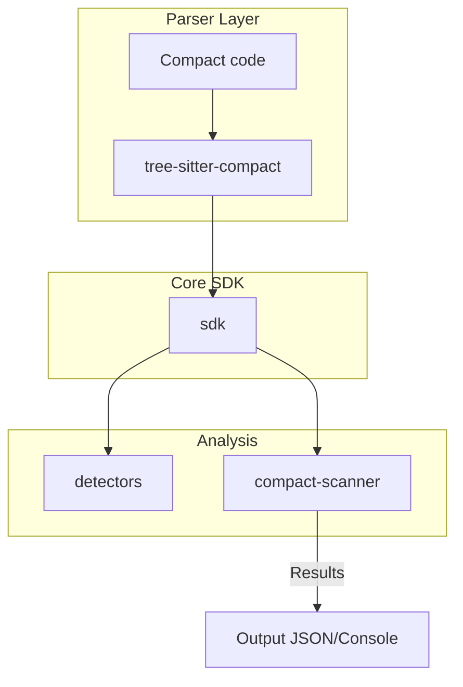

[](https://github.com/OpenZeppelin/midnight-security-detectors-sdk/actions/workflows/build.yml)
[](https://github.com/OpenZeppelin/midnight-security-detectors-sdk/actions/workflows/release.yml)

# Midnight Security Detectors

A suite of tools and libraries for analyzing `Compact` language circuits for security vulnerabilities within the Midnight platform.

## Repository Structure

This workspace includes the following crates:

- `sdk`: Core SDK for building the AST, codebase, and writing custom security detectors.
- `detectors`: Built-in security detectors for common vulnerability patterns.
- `compact-scanner`: CLI tool to scan `.compact` files and run detectors.
- `parser`: LALRPOP parser definitions for the Compact language.
- `tree-sitter-compact`: Tree-sitter grammar crate for the Compact language.

## Quickstart

1. Build the project:
   ```sh
   cargo build --workspace
   ```

2. Install the CLI scanner:
   ```sh
   cargo install --path compact-scanner
   ```

3. Scan a directory of `.compact` files:
   ```sh
   compact-scanner scan ./corpus --output-format json
   ```

## Documentation

Detailed developer guides for each crate:

- SDK: `sdk/docs/index.md`
- Detectors: `detectors/docs/index.md`
- CLI Scanner: `compact-scanner/docs/index.md`

## Architecture Overview



For detailed architecture, see `sdk/docs/architecture.md`.
